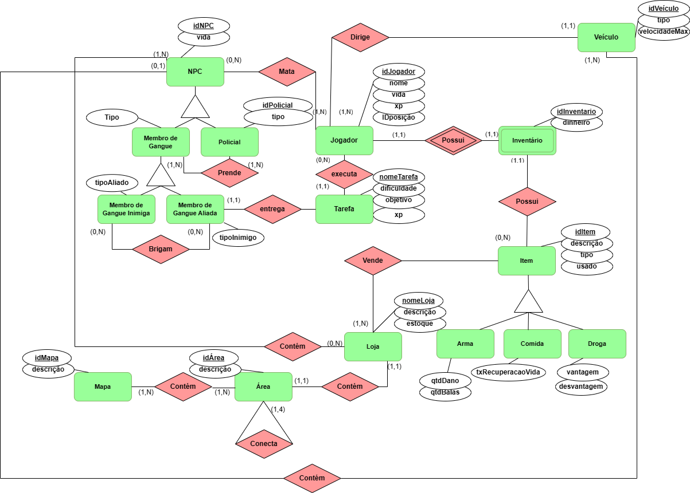
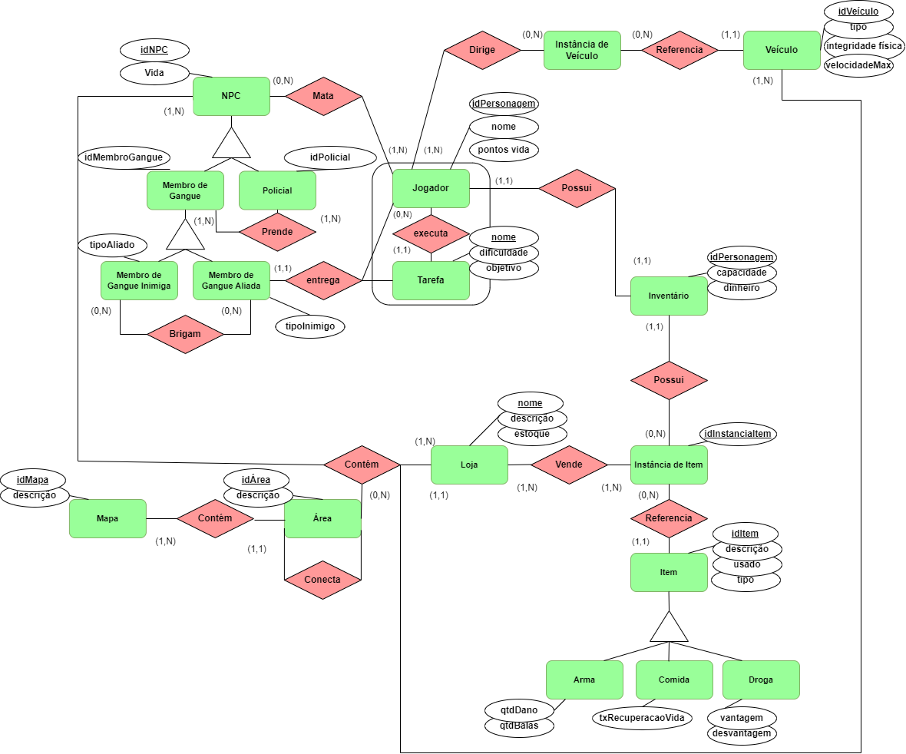

## Histórico de revisão

  | Data       | Versão | Alteração                                                   | Autor                                     |
  | ---------- | ------ | ----------------------------------------------------------- | ----------------------------------------- |
  | 28/11/2022 | 0.1    | Primeira versão da modelagem DER                            | Letícia, Thiago, Davi, Vinícius e Lorenzo |
  | 12/12/2022 | 0.2    | Segunda versão da modelagem DER                             | Letícia                                   |
  | 17/12/2022 | 0.3    | Adição de cardinalidade e outras correções da modelagem DER | Thiago e Davi                             |
  | 11/01/2023 | 0.4    | Correções pedidas pelo professor                            | Lorenzo                                   |
  | 15/01/2023 | 0.5    | Ajuste de detalhes do DER                                   | Davi                                      |

  # Diagrama Entidade Relacionamento (DER)
  
  

  
  
  # Versões Anteriores
  ## Primeira Versão
  
  

  ## Segunda Versão
  
  

